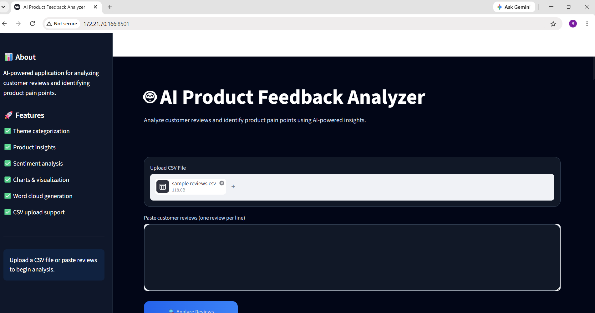
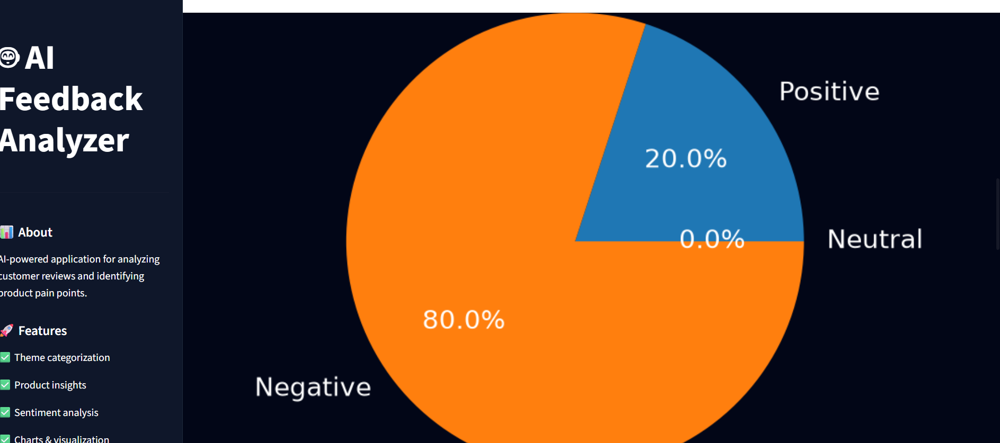

# AI Product Feedback Analyzer

An AI-powered web application that analyzes customer reviews and identifies product pain points using sentiment analysis and visualization.

## Features

- Customer review analysis
- Theme categorization
- Sentiment analysis
- Product improvement suggestions
- CSV upload support
- Word cloud visualization
- Downloadable reports

## Tech Stack

- Python
- Streamlit
- Pandas
- Matplotlib
- TextBlob
- WordCloud

## How It Works

1. Upload customer reviews or paste them manually
2. Analyze recurring product issues
3. Generate sentiment insights
4. Visualize trends using charts and word clouds
5. Download analysis reports

## Screenshots

### Dashboard


### Theme Analysis & Priority Pain Points


### Sentiment Analysis


### Pie Chart


### Bar Chart


### Word Cloud


### Download Report Feature

## Run Locally

```bash
pip install -r requirements.txt
python -m streamlit run app.py
```

## Future Improvements

- OpenAI API integration
- Advanced NLP models
- Real-time dashboard
- Authentication system


